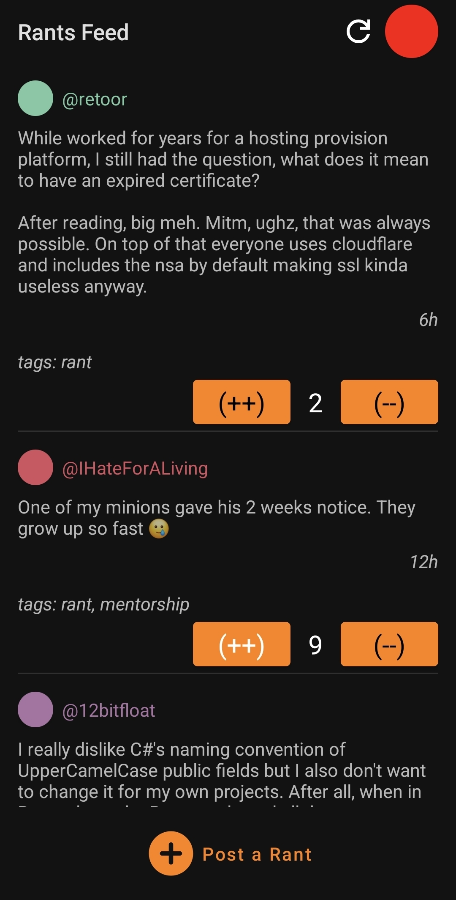
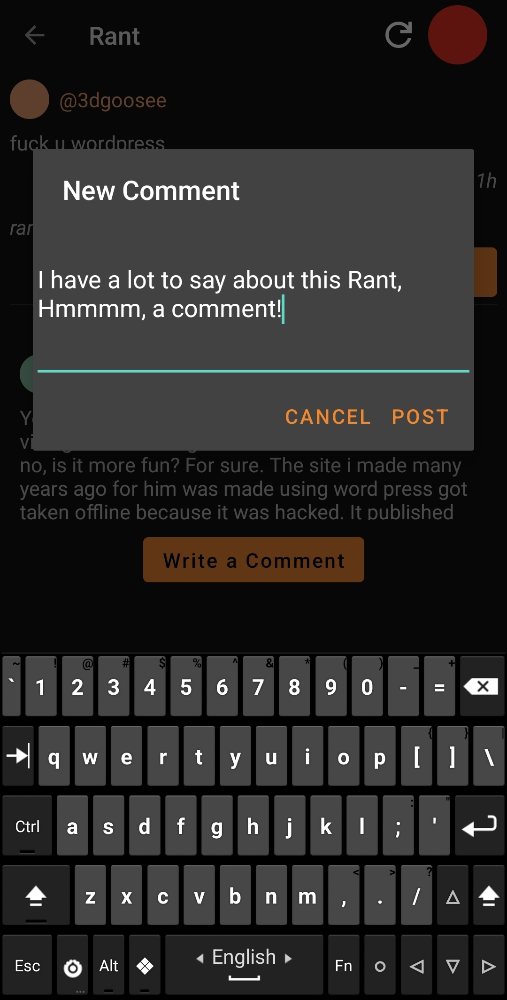
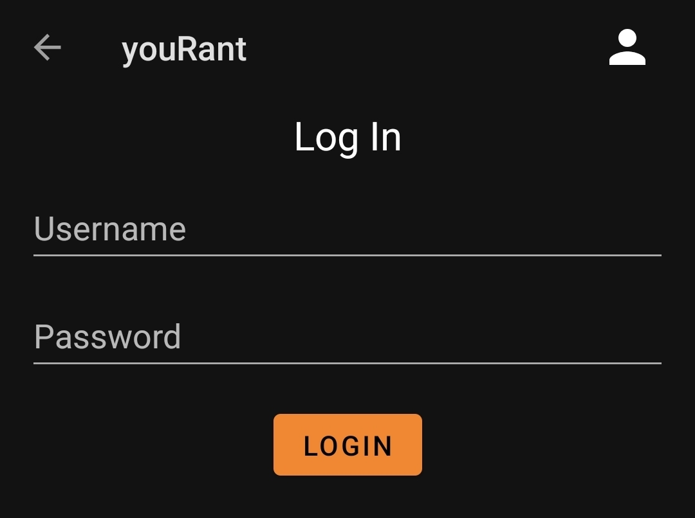
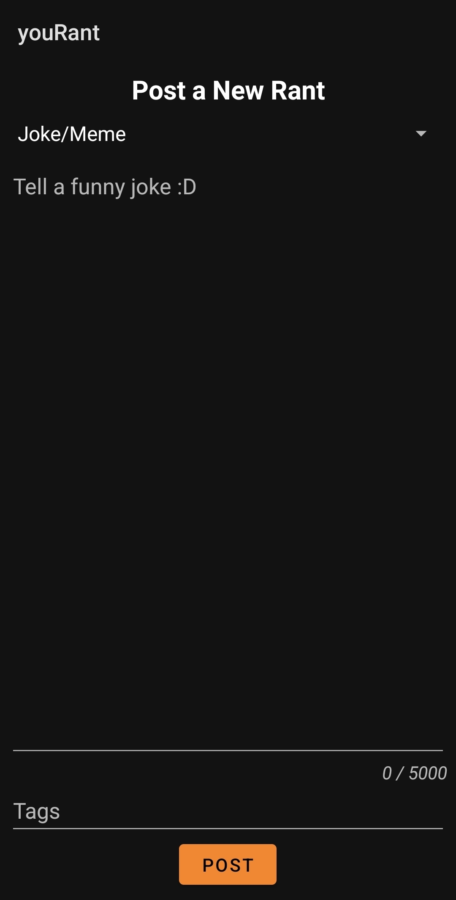

# youRant - Alpha WIP
(Prounounced as 'Your Rant' and not 'You Rant') youRant is an android application for browsing [devRant](https://devrant.com), and is an UNOFFICIAL third party devRant client for android.



> ***Note**: Due to devRant's expired certificates, using retoor's [dr.molodetz.nl](https://dr.molodetz.nl) domain instead of [devrant.com](https://devrant.com).*

## Table of Contents
- [Features](#features)
    * [Planned Features (Short Term - MVP)](#planned-features-short-term---mvp)
    * [Planned Features (Long Term - Alpha version)](#planned-features-long-term---alpha-version)
    * [Planned Features (Beta version)](#planned-features-beta-version)
    * [Post Release Features](#post-release-features)
- [Development Roadmap to Release](#development-roadmap-to-release)
- [Known Bugs](#known-bugs)
- [Installation](#installation)
    * [Easy way - Download APK](#easy-way---download-apk)
    * [Compiling from source](#compiling-from-source)
- [Special Thanks!](#special-thanks)
- [Images](#images)

## Features
Currently the following things are implemented:
- The rants feed.
- Viewing rants and comments.
- Logging in.
- Posting a new rant.
- Posting a comment on a rant.

***Note**: The upvote and downvote buttons are currently not implemented and are just for show.*

---
***Note**: The lists of Planned Features are themselves not final, and may be subject to change.*
### Planned Features (Short Term - MVP)
The following features are considered a high priority:
- Certificate pinning and switching back to the original devrant domain (currently using `dr.molodetz.nl`)
- Notifications (Both Native and from the RSS)
- Working upvote/downvote
- Display attached images

### Planned Features (Long Term - Alpha version)
The following features are considered a medium priority:
- User Profiles
- Settings Page
- Deleting and editing rants and comments
- User mentions displayed as links to profile
- Subscribing to users

### Planned Features (Beta version)
- "Attaching" images to posts/comments using [devrant.molodetz.nl](https://devrant.molodetz.nl)
- Profile Pictures(dR avatars)
- Favoritting Posts
- Editting Profiles
- Collabs
- UI improvments
- Search
- Signing Up

### Post Release Features
The following features **may** be worked on after the release(v1.0) of 'youRant':
- Themes

## Development Roadmap to Release
- [ ] Alpha Release
    * [x] Rants Feed
    * [x] Rant Page (Viewing a rant and it's comments)
    * [x] Authentication (Login and safely store auth tokens)
    * [x] Posting rants and comments
    * [ ] Certificate pinning, and switch API requests from 'dr.molodetz.nl/api' back to 'devrant.com/api'
    * [ ] Notifications
    * [ ] Upvoting & Downvoting
    * [ ] Display Attachments
- [ ] Beta Release
    * [ ] User Profiles
    * [ ] Settings
    * [ ] Edit & Delete
    * [ ] Clickable '@' mentions
    * [ ] Subscribing
- [ ] Full Release
    * [ ] Attach media to rants & comments
    * [ ] Avatars
    * [ ] Favorites
    * [ ] Profile Editting
    * [ ] Better UI
    * [ ] Collabs
    * [ ] Searching
    * [ ] Sign Up
- Post Release
    * [ ] Themes?

## Known Bugs
- Cosmetic HTML tags in the rant page within the content of the rant or comments are parsed as HTML code. Fixing Priority - High.

## Installation
### Easy way - Download APK
First, you need to allow sideloading APKs on your android device:
```
Go to Settings -> Apps -> Stack Menu(Three dots) on the top right -> Special access -> Install unknown apps
```
You will see a list of apps, enable for Chrome(/other browser you downloaded the app from) or a File Manager app, or through any other app that you wish to install the APK from.

Download the APK file from the [Releases](https://github.com/yuriKhordal/youRant/releases/latest) page to your device and launch to install, Google Play Protect will ask you to scan the app, you can let it scan.

### Compiling from source
You will need Android Studio installed to compile the project.
First, clone the repository:
```bash
git clone https://github.com/yuriKhordal/youRant.git
```
Open the project in android studio and either run directly from there, or generate APKs through the build menu.
Generated APKs will be in `app/build/outputs/apk/debug/` or `app/release`.

## Special Thanks!
- [Retoor](https://molodetz.nl) for the various devRant related tools that youRant is using.
- [Lensflare](https://github.com/WilhelmOks), creator and active developer of joyRant (a third-party iOS devRant client), for various tips and miscelanious help regarding making a mobile devRant client.

## Images
### Rant Page


### Commenting on a Rant


### Login Screen


### Posting a New Rant

